# Creado por Jeffrey Vargas

# Page 1

Confidential – Oracle Internal 
Creación de Asistente Digital IA en OCI 
I. Crear política de IA en el tenant 
Navegamos a Identity & Security -> Policies 

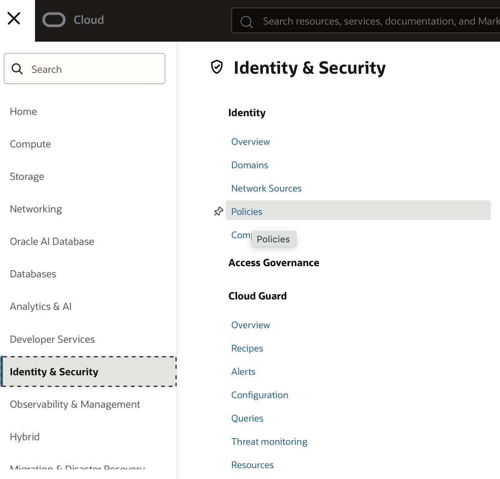

# Page 2

Confidential – Oracle Internal 
Create Policy -> Crear una nueva política en el compartment root, 
Poner Nombre, Descripción y seleccionar Show manual editor 
Poner las siguientes instrucciones: 
Allow any-user to inspect buckets in tenancy 
Allow any-user to read objects in tenancy 
Allow any-user to use database-tools-connections in tenancy 
Allow any-user to read database-tools-family in tenancy 
Allow any-user to read secret-family in tenancy 
Allow any-user to {BUCKET_INSPECT, BUCKET_READ, OBJECT_INSPECT, 
OBJECT_READ, OBJECT_CREATE, OBJECT_OVERWRITE, PAR_MANAGE} in tenancy 

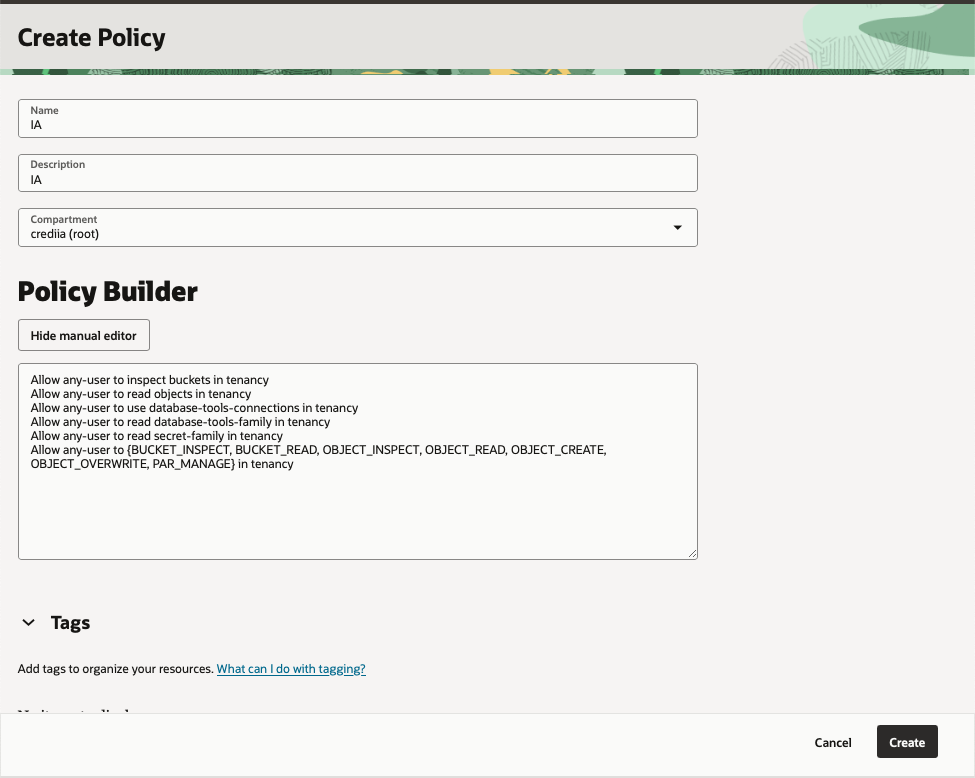

# Page 3

Confidential – Oracle Internal 
II. Creación de Compartment 
Navegamos a Identity & Security -> Compartments  
 
Create compartment -> Poner Nombre y Descripción, usar este compartment para crear 
todos los recursos de este laboratorio. 

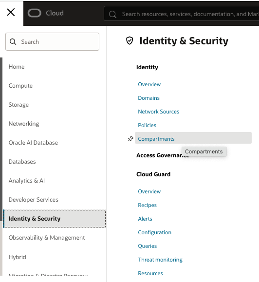

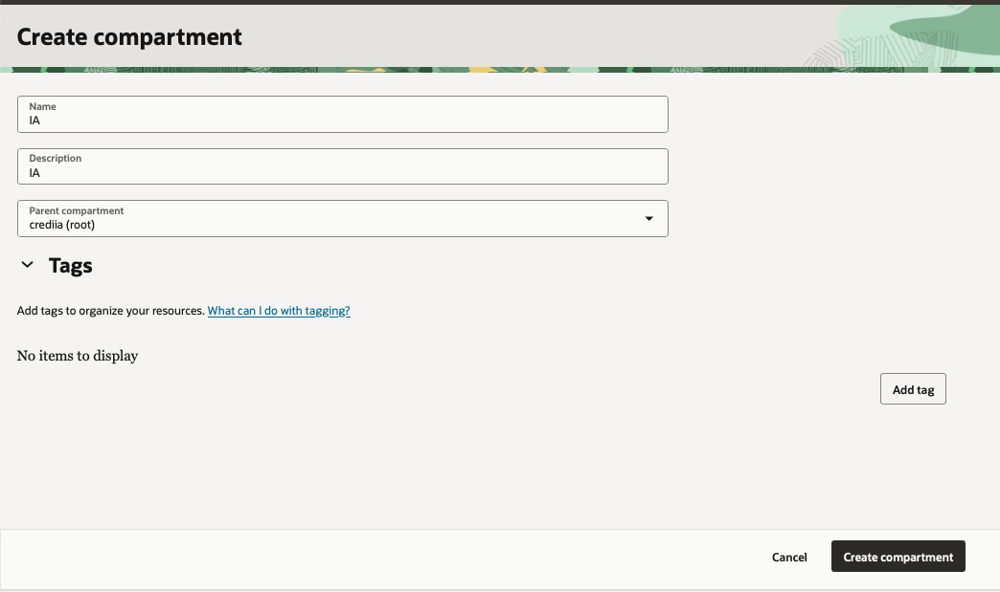

# Page 4

Confidential – Oracle Internal 
III. Creación de VCN 
Navegamos a Networking -> Virtual Cloud Networks 
 
Crear una nueva VCN a partir del Wizard y dejamos los valores por defecto 
 
Poner Nombre y crear. 

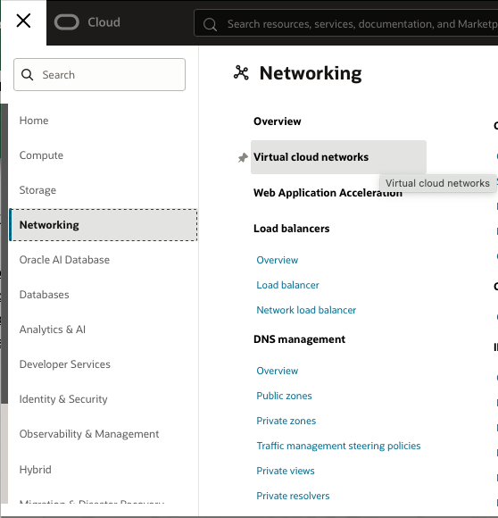

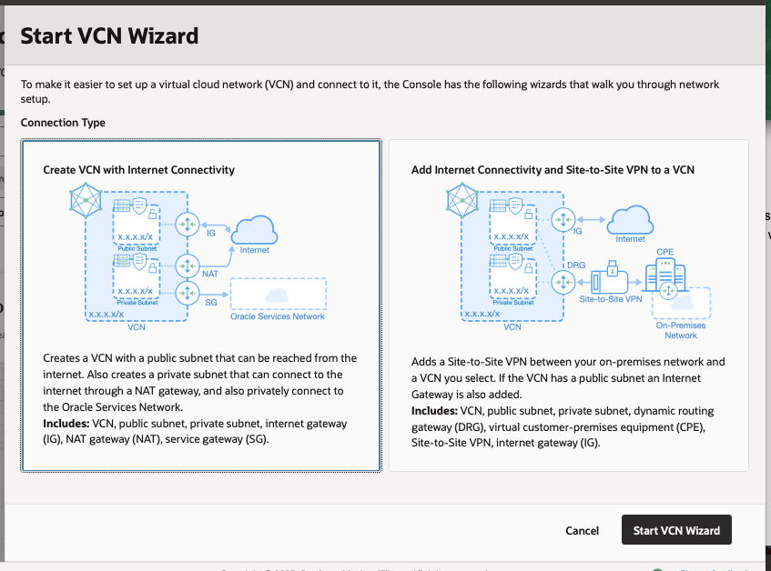

# Page 5

Confidential – Oracle Internal 
Una vez creada la VCN entrar a la lista de seguridad de la sub red pública y habilitar los 
puertos TCP 80 y 8501 
 
IV. Creación del Bucket 
Navegamos a Storage -> Buckets 

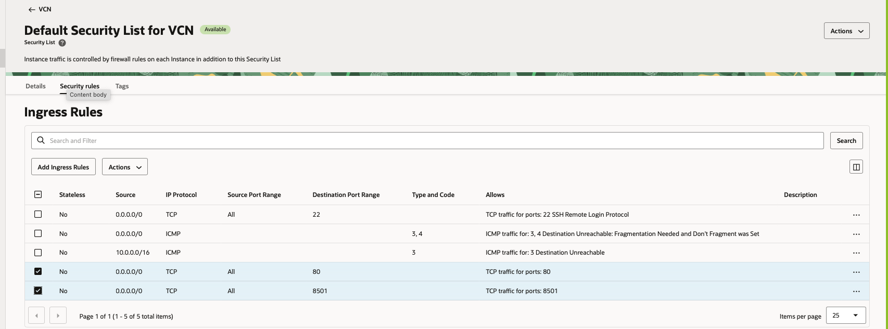

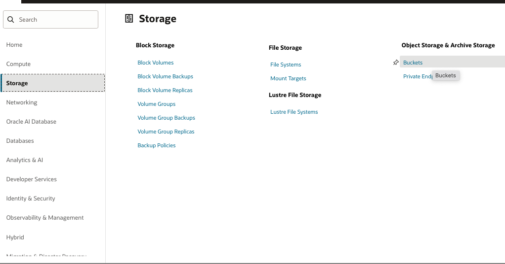

# Page 6

Confidential – Oracle Internal 
Create bucket -> La creación puede realizarse con los parámetros por defecto, solo se 
debe de agregar el nombre. 
Este Bucket contendrá el sitio web que descargaremos y subiremos posteriormente. 

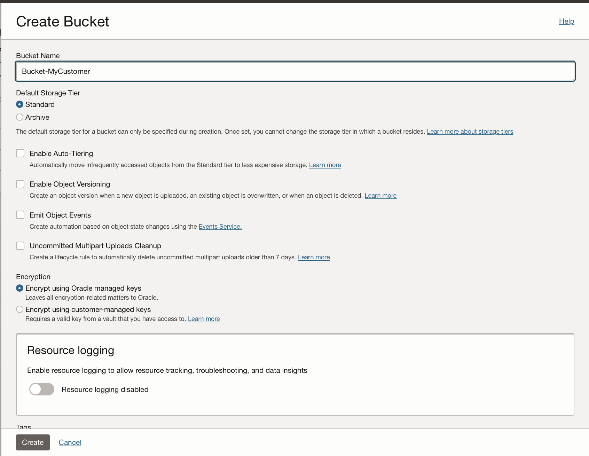

# Page 7

Confidential – Oracle Internal 
V. Creación de Máquina Virtual en OCI 
Crear una máquina virtual con sistema operativo OL9, procesador Intel o AMD y en una 
subred pública que tenga salida a los puertos 80 y 8501 
Configuración en la lista de seguridad de la subred pública: 
# Ingresar a la máquina virtual con el comando ssh 
ssh -i llave.key opc@PublicIP 
Realizar la instalación dentro de la maquina: 
Lo primero que realizaremos es la instalación y configuración del OCI CLI 
Cualquier duda de instalación referenciar a este link:  
https://docs.oracle.com/es-ww/iaas/Content/API/SDKDocs/cliinstall.htm 
# Instalar CLI 
sudo dnf -y install oraclelinux-developer-release-el9 
sudo dnf install python39-oci-cli 
# Validamos la instalación: oci -v 
oci -v 
# Realizamos la configuración: 
oci setup config 
# Probamos que traiga nuestro Object storage namespace 
oci os ns get 

# Page 8

Confidential – Oracle Internal 
VI. Descargar el Sitio: 
Se identifica la página web principal y a través del comando wget se descarga el sitio. 
Nota: Podría ser que el sitio este protegido en ese caso tendríamos que pensar en un plan 
B como descargar los archivos htmls y PDFs manualmente de las páginas de interés o 
modificar esta instrucción. 
Página de ejemplo: https://www.mycustomer.com 
cd $HOME 
wget --recursive --level=3 --no-parent --adjust-extension --convert-links --domains= 
www.grupomutual.fi.cr, grupomutual.fi.cr --
reject="jpg,jpeg,png,gif,svg,webp,ico,css,js,woff,woff2,ttf,mp4,avi,pdf" --header="Accept: 
text/html" --header="Accept-Language: es-CR,es;q=0.9,en;q=0.8" --user-agent="Mozilla/5.0 (Windows 
NT 10.0; Win64; x64) AppleWebKit/537.36 (KHTML, like Gecko) Chrome/115.0 Safari/537.36" --execute 
robots=off --directory-prefix=html https://www.grupomutual.fi.cr/  
Notas:  
• Las partes marcadas en amarillo son las que deben ser sustituidas por el nuevo 
sitio web a trabajar. 
• El sitio quedara en la ruta /home/opc/html 

• Sacar una copia del index.html para ser modificada después y dejarlo en la ruta 
/home/opc/ 

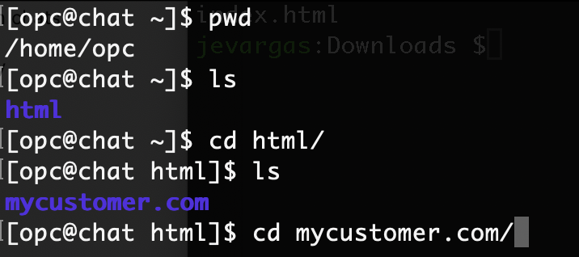

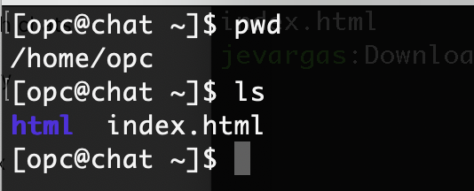

# Page 9

Confidential – Oracle Internal 
VII. Cargar sitio web al Bucket. 
El comando para cargar en modo bulk el sitio a OCI es: 
cd $HOME 
oci os object bulk-upload --bucket-name Bucket-MyCustomer --src-dir 
/home/opc/html/ --namespace axhxyz2qo8xt 
Notas:  
• Las partes marcadas en amarillo son las que deben ser sustituidas por los valores 
de su ambiente 
• Validar una vez terminado el comando que en el bucket los archivos hayan sido 
cargados exitosamente. 

# Page 10

Confidential – Oracle Internal 
VIII. Creación del Knowledge Base para nuestro agente. 
Una vez que el sitio ya se encuentre cargado en nuestro Bucket procederemos a crear el 
Knowledge Base. 
Nota: Se puede dejar creando este componente y avanzar con el tutorial. 
Menu: Analytics & AI -> Generative AI Agents -> Knowledge Bases 

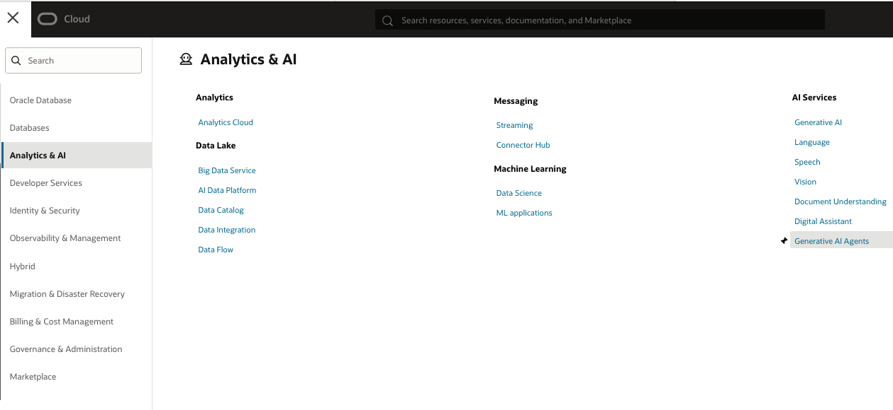

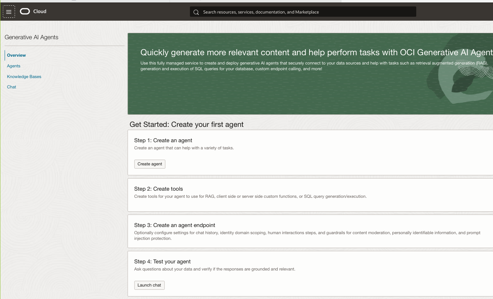

# Page 11

Confidential – Oracle Internal 
 
En la creación debemos de introducir un nombre, importante que el Data storage type sea 
Object storage, marcar el check de Enable hybrid search y definir el data source 

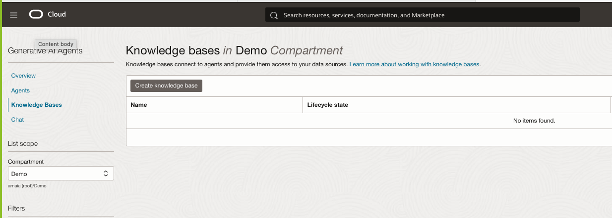

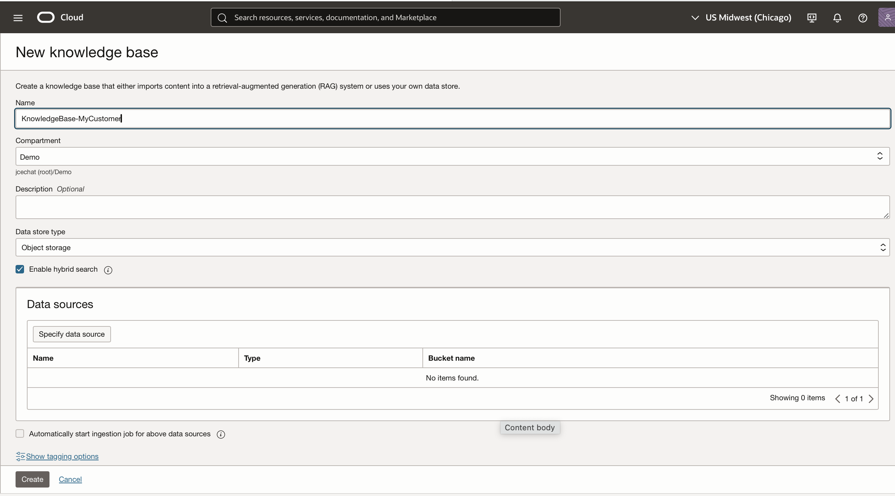

# Page 12

Confidential – Oracle Internal 
En el data source poner: 
Un nombre, habilitar Enable multi-modal parsing, seleccionar el Bucket creado 
anteriormente, habilitar Select all in bucket y crear 

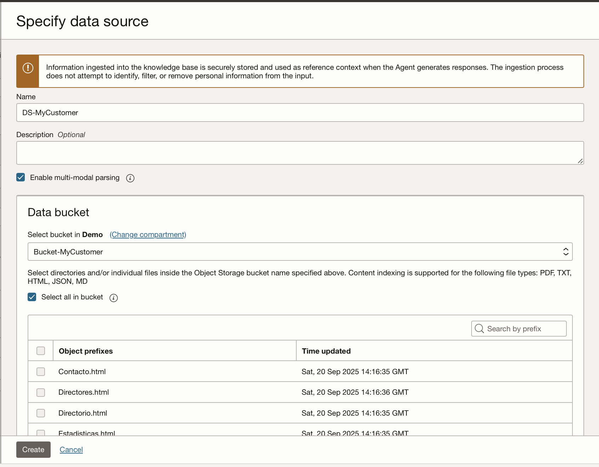

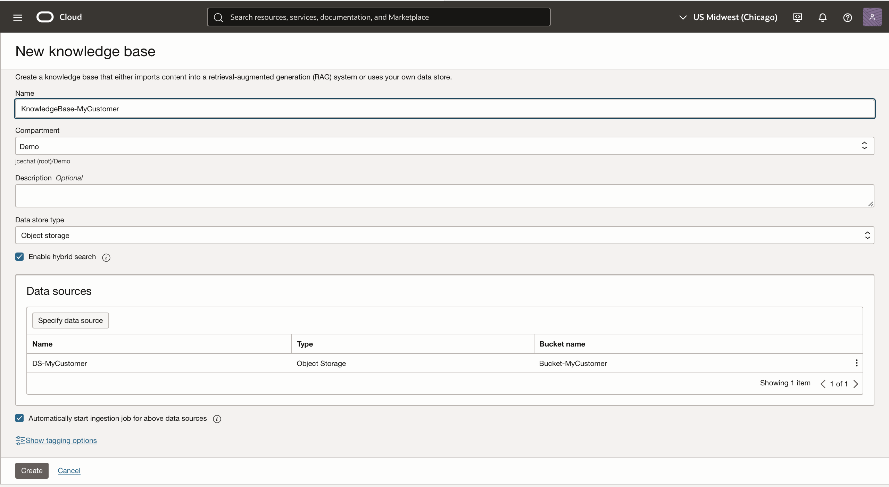

# Page 13

Confidential – Oracle Internal 
IX. Creación del Agente: 
Nota Importante: El Knowledge Bases no será relacionado al agente en este momento, ya 
que eso se hará a través del código al igual que las instrucciones del ruteo; Además, se 
puede dejar creando este componente y avanzar con el tutorial. 
En la primera página se debe de agregar el nombre y darle Next 

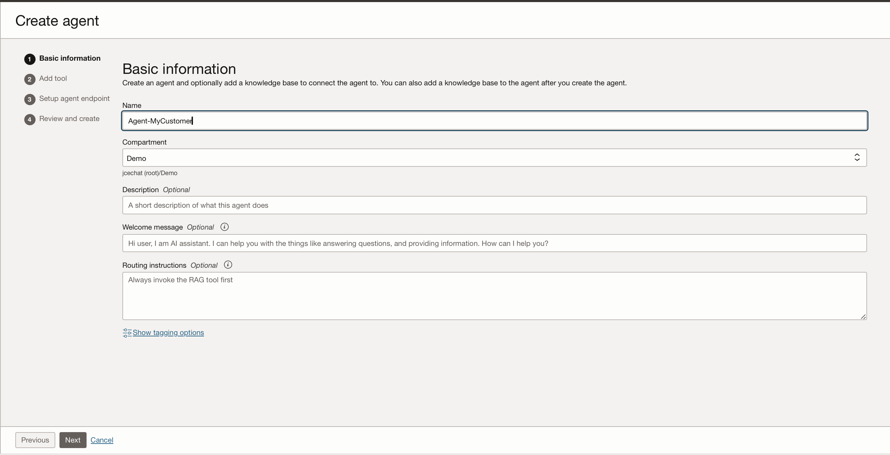

# Page 14

Confidential – Oracle Internal 
Segunda página dejarla así y Next 
 
Tercera página dejarla igual y Next 

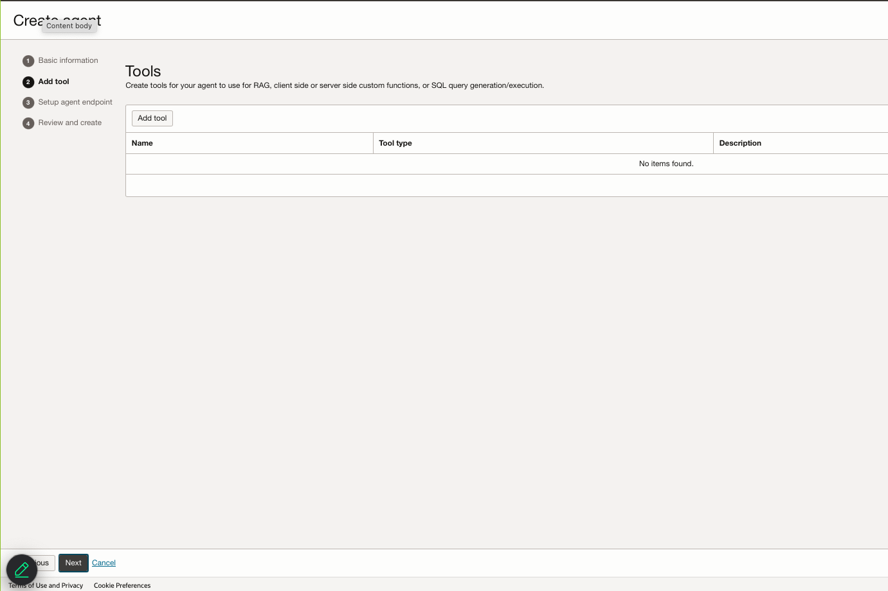

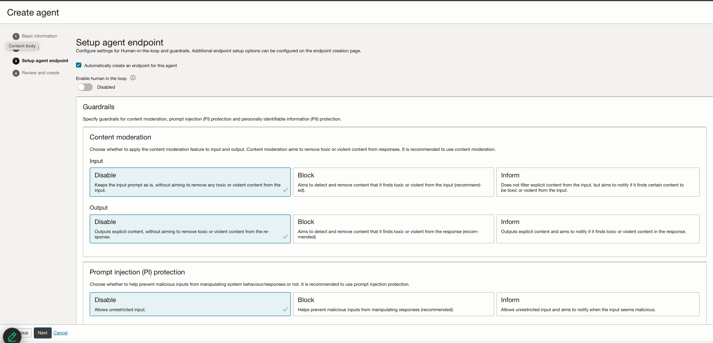

# Page 15

Confidential – Oracle Internal 
Cuarta página crear agente y aceptar política 

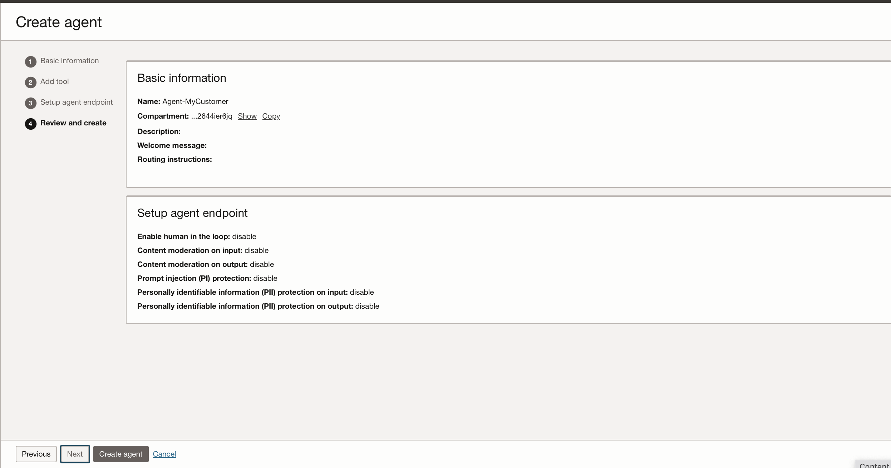

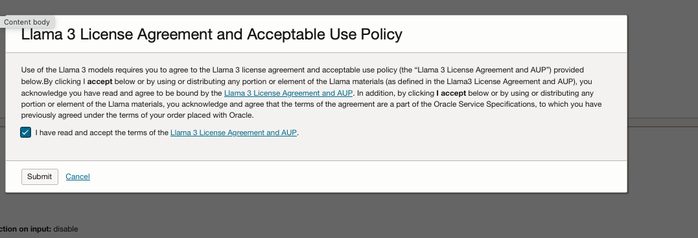

# Page 16

Confidential – Oracle Internal 
X. Configuración de la Aplicación  
Para esta parte nos devolvemos a la máquina virtual previamente creada 
# Ingresar a la máquina virtual con el comando ssh 
ssh -i llave.key opc@PublicIP 
#  Configurar Networking 
sudo firewall-cmd --permanent --add-port=8501/tcp 
sudo firewall-cmd --reload 
#  Descargar la aplicación desde github 
cd $HOME 
wget https://github.com/jevargascr/OCI_AI_Digital_Agent/archive/refs/heads/main.zip 
unzip main.zip -d temp 
mv temp/OCI_AI_Digital_Agent-main/* . 
rm -rf temp 
rm main.zip 
rm README.md 
Nuestro directorio $HOME se debería de ver así 
 
# Instalación de Python 11 
sudo dnf -y update 
sudo dnf install -y python3.11 python3.11-devel 
 
# Creación ambiente virtual 
cd $HOME 
cd Agente 
/usr/bin/python3.11 -m venv IA-VENV 
source IA-VENV/bin/activate 

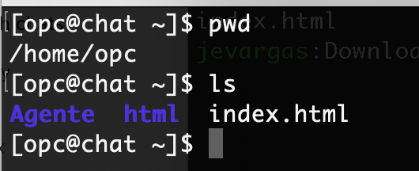

# Page 17

Confidential – Oracle Internal 
# Validar que las versiones sean la 11 
python -V   
pip -V  
 
# Instalar actualizaciones y requisitos 
cd $HOME/Agente/ 
python -m pip install --upgrade pip 
pip install -r requirements.txt 
 
# Se debe de editar el archivo config_agent.py que se encuentra dentro de la carpeta UI 
para sustituir estos valores: 
knowledge_base_id= 
agent_endpoint_id= 

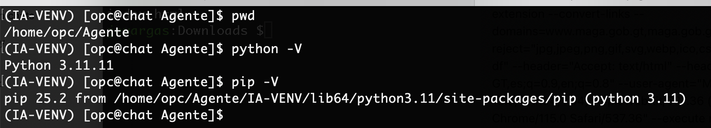

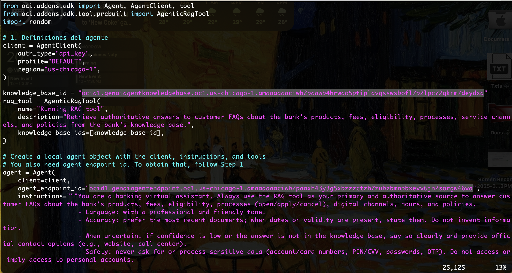

# Page 18

Confidential – Oracle Internal 
Notas: 
El  knowledge_base_id es el OCID de nuestra base de datos de conocimiento y en OCI se 
encuentra en Menu: Analytics & AI -> Generative AI Agents -> Knowledge Bases -> OCID 

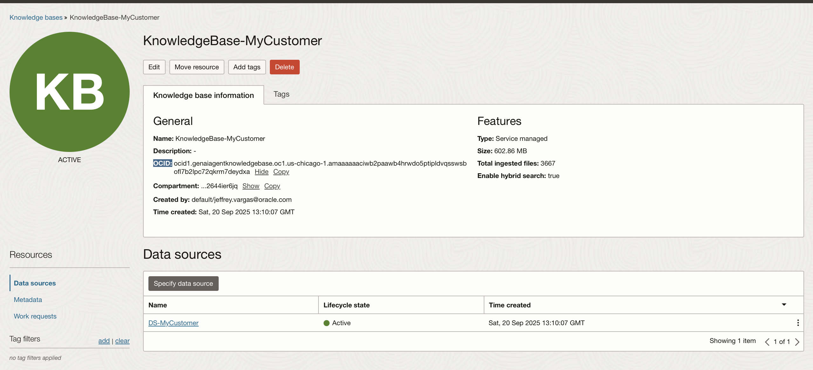

# Page 19

Confidential – Oracle Internal 
El  agent_endpoint_id es el OCID del Endpoint de nuestro agente y en OCI se encuentra en 
Menu: Analytics & AI -> Generative AI Agents -> Agents -> Endpoint -> OCID 

# Editar 
cd $HOME/Agente/UI/ 
vi config_agente.py 

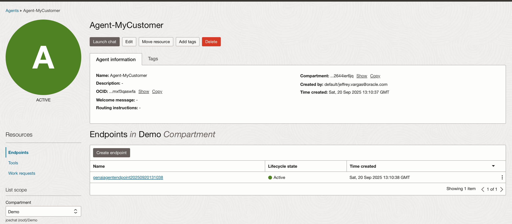

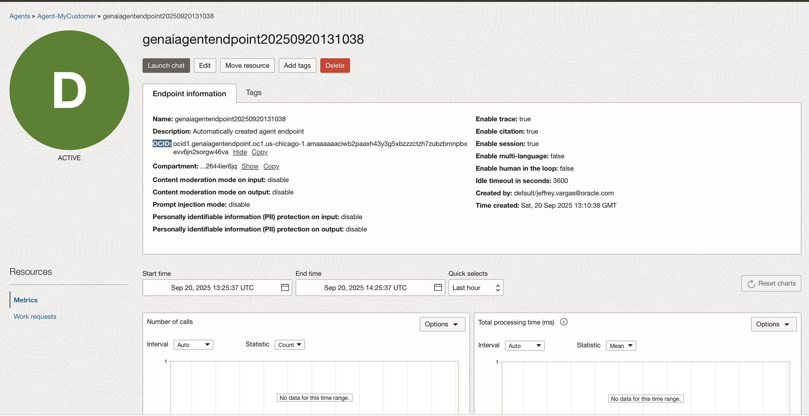

# Page 20

Confidential – Oracle Internal 
# Correr la aplicación y probar que el bot funciona 
Nota: Antes de ejecutar la app garantizarse que la creación del Agent y Knowledge base 
hayan finalizado y que se completara el proceso de carga de la base de datos de 
conocimiento (el Ingestion job debe de estar Completado). 
 
# Prueba Inicial 
cd $HOME/Agente/UI/ 
streamlit run app.py  
 
Abrir dirección Externa, se debería de ver así (inicia con un proceso de instalación tener 
paciencia) 

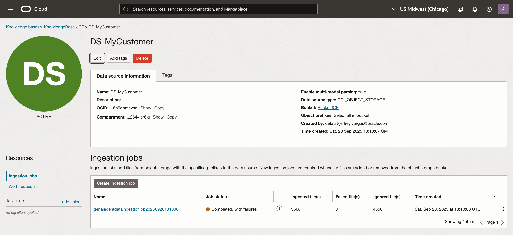

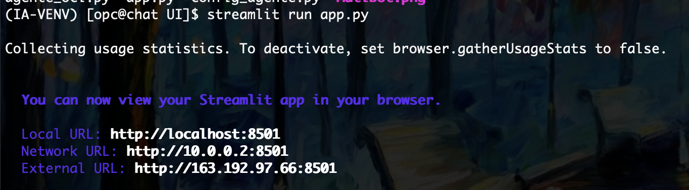

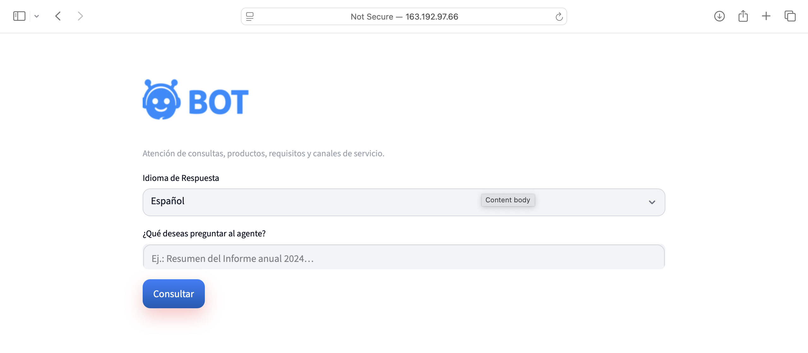

# Page 21

Confidential – Oracle Internal 
 
# Una vez que el Bot sea probado lo podemos correr y que se mantenga corriendo, aunque 
se termine la sesión, se deja un archivo de log que puede ser consultado después 
cd $HOME/Agente/UI/ 
nohup streamlit run app.py > streamlit.log 2>&1 & 
# En caso de necesitar matar el proceso 
cd $HOME/Agente/UI/ 
pkill -f "streamlit run app.py"    
rm streamlit.log  

# Page 22

Confidential – Oracle Internal 
XI. Configuración del Sitio Web 
La idea principal es poder embeber nuestro asistente digital en una copia local de la 
página principal de nuestro cliente, recordemos que en pasos anteriores habíamos 
realizado una copia en $HOME 
# Modificación del index.html 
Se debe de modificar el index.html 
cd $HOME 
vi index.html 
Agregar este código justo antes de cerrar el body, pero antes modificar lo que está en 
amarillo por la dirección publica de su máquina virtual. 
<!-- Estilos para el botón flotante y el panel --> 
   
  <!-- Contenedor del iframe oculto --> 
  
 
    <iframe id="asistente-iframe" src=""></iframe> 
  
 
 
  <!-- Botón flotante (emoji correcto en UTF-8; alternativa con entity: &#129302;) --> 
  <button id="asistente-launcher" onclick="toggleAsistente()">🤖 Asistente Digital</button> 
  <!-- Lógica para mostrar/ocultar el iframe --> 
   

# Page 24

Confidential – Oracle Internal 
# Habilitation de Networking 
sudo firewall-cmd --permanent --add-port=8080/tcp 
sudo firewall-cmd --permanent --add-service=http 
sudo firewall-cmd --reload 

# Page 25

Confidential – Oracle Internal 
# Instalación de webserver nginx 
sudo dnf install -y nginx 
sudo systemctl enable --now nginx 
sudo mkdir -p /etc/nginx/conf.d 
# Copiar este comando como un solo bloque 
sudo tee /etc/nginx/conf.d/misitio.conf > /dev/null <<'NGINX' 
server { 
    listen 80; 
    server_name _; 
 
    root /var/www/misitio; 
    index index.html; 
 
    location / { 
        try_files $uri $uri/ =404; 
    } 
 
    # Proxy a Streamlit en /app/ 
    location /app/ { 
        proxy_pass http://127.0.0.1:8501/; 
        proxy_http_version 1.1; 
        proxy_set_header Upgrade $http_upgrade; 
        proxy_set_header Connection "upgrade"; 
        proxy_set_header Host $host; 
        proxy_set_header X-Forwarded-Proto $scheme; 
        proxy_set_header X-Forwarded-For $remote_addr; 
        proxy_read_timeout 86400; 
    } 
} 
NGINX 

# Page 26

Confidential – Oracle Internal 
# Continuar con la configuración 
sudo mkdir -p /var/www/misitio 
sudo cp index.html /var/www/misitio/index.html 
sudo semanage fcontext -a -t httpd_sys_content_t '/var/www/misitio(/.*)?' || true 
sudo restorecon -Rv /var/www/misitio 
sudo nginx -t 
sudo systemctl restart nginx 
sudo systemctl status nginx 
 
Probar con la IP publica: 
http://64.181.201.189 

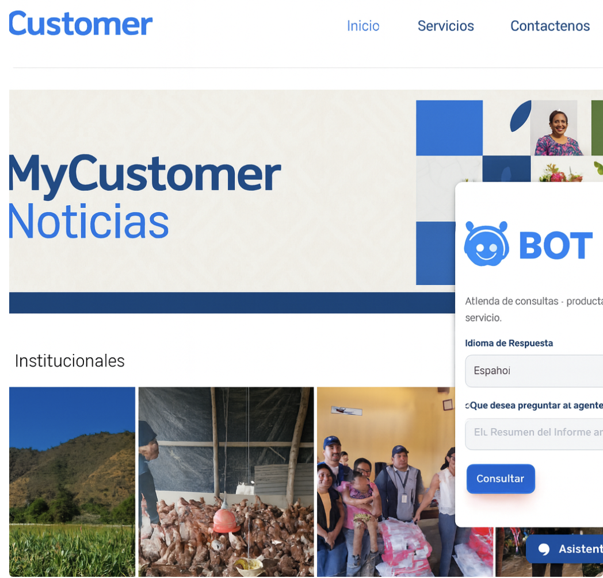
